#  Data Ingestion Pipeline: S3 → RDS with AWS Glue Fallback (Dockerized Python Application)


---

#  Project Overview

This project implements a **cloud-based data ingestion pipeline** using AWS services and a **Dockerized Python application**.

The application reads a **CSV dataset stored in Amazon S3**, processes it using **Python and Pandas**, and attempts to insert the records into an **Amazon RDS MySQL database**.

If the database connection fails or the insert operation fails, the application automatically **falls back to AWS Glue Data Catalog**, where the dataset location in S3 is registered and its schema is stored.

This architecture demonstrates how to build a **fault-tolerant and resilient cloud data pipeline**.

---

#  Architecture Diagram

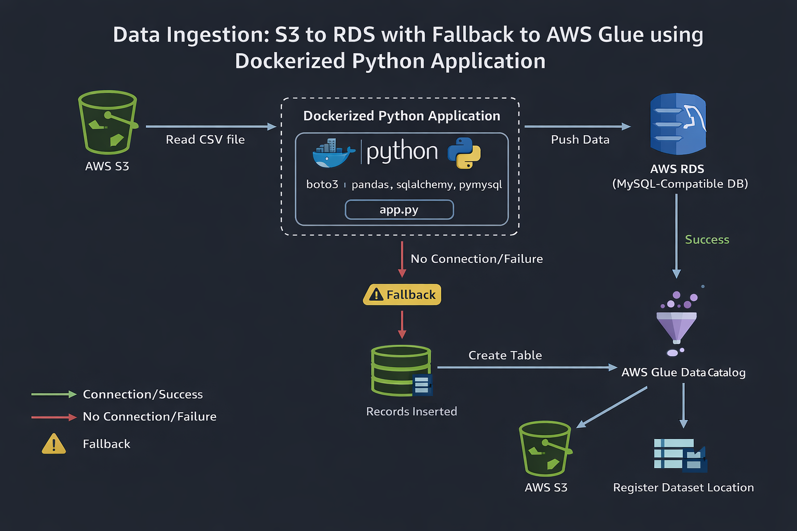

---

#  Data Flow

```
Amazon S3 (CSV Dataset)
        │
        ▼
Dockerized Python Application
(app.py using boto3, pandas, sqlalchemy)
        │
        ▼
Amazon RDS MySQL Database

If Success
        ▼
Records Stored in RDS

If Failure
        ▼
AWS Glue Data Catalog
        ▼
Table Created + Dataset Registered
```

---

#  AWS Services Used

| Service    | Purpose                                |
| ---------- | -------------------------------------- |
| Amazon S3  | Stores CSV dataset                     |
| Amazon RDS | Primary relational database            |
| AWS Glue   | Fallback metadata catalog              |
| Amazon EC2 | Used to access RDS database            |
| Docker     | Containerization of Python application |

---

#  Technologies Used

* Python 3.9
* Docker
* Pandas
* Boto3
* SQLAlchemy
* PyMySQL

---

#  Project Structure

```
s3-rds-glue-project
│
├── app.py
├── Dockerfile
├── requirements.txt
├── README.md
│
└── img/
     
```

---

#  Step 1: Create S3 Bucket

Create an Amazon S3 bucket to store the CSV dataset.

Example bucket name:

```bash
devops-data-pipeline-bucket-123
```

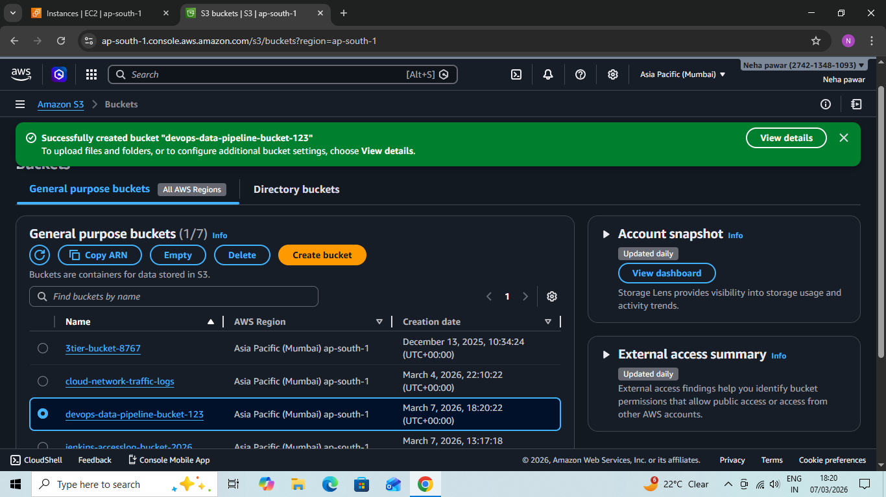

---

#  Step 2: Upload CSV File

Upload the dataset (`data.csv`) to the S3 bucket.

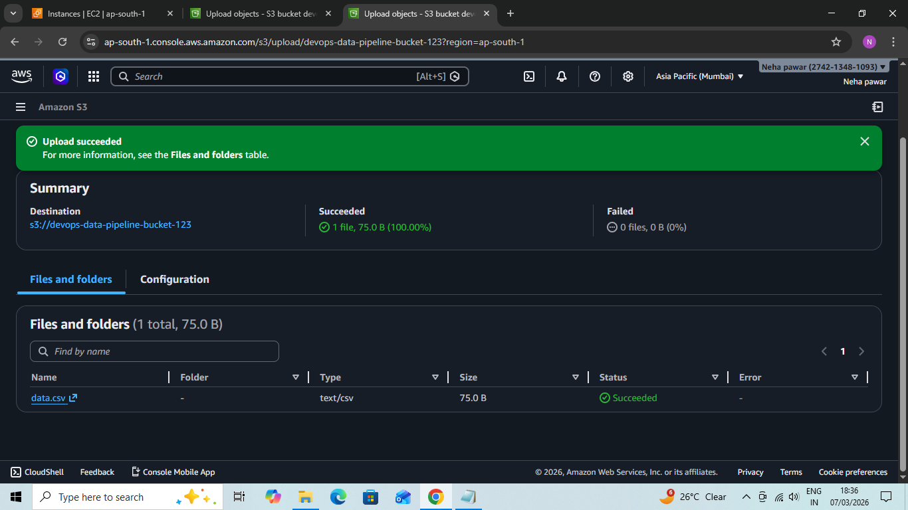

---

#  Step 3: Create Amazon RDS MySQL Database

Create an RDS MySQL database instance.

Example database identifier:

```bash
devops-mysql-db
```

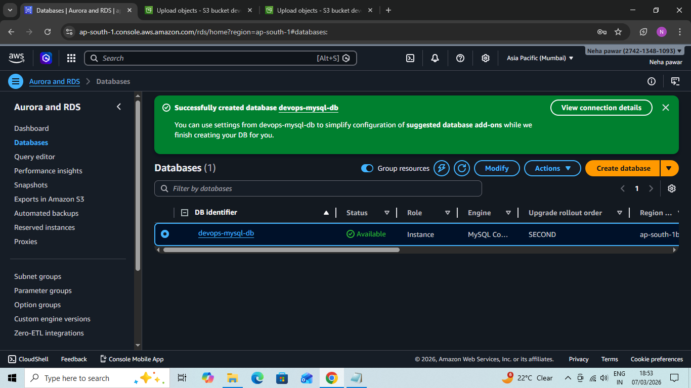
---

#  Step 4: Create AWS Glue Database

Create a database in AWS Glue Data Catalog.

Example database name:

```bash
devops_glue_db
```

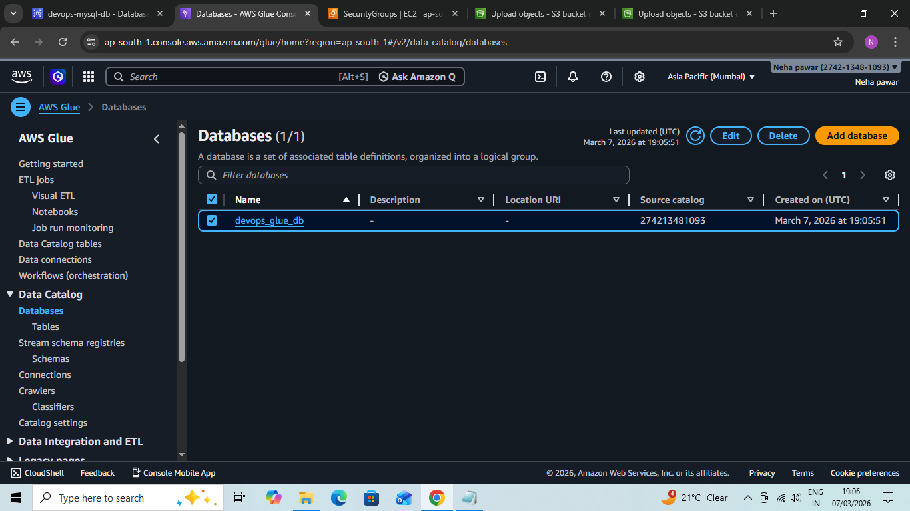

---

#  Step 5: Python Application

The Python script performs the following operations:

* Connects to Amazon S3
* Reads the CSV file
* Processes the data using Pandas
* Attempts to insert records into Amazon RDS
* If database connection fails:

  * Creates table in AWS Glue
  * Registers dataset location in S3

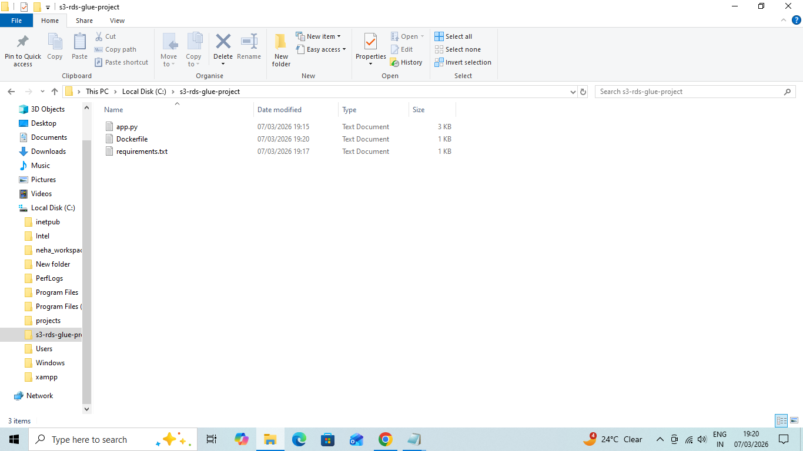

---

#  Step 6: Docker Containerization

The application is packaged into a Docker container.

Dockerfile responsibilities:

* Uses Python base image
* Installs required dependencies
* Copies application code
* Executes Python script

---

#  Build Docker Image

Run the following command:

```bash
docker build --no-cache -t s3-rds-pipeline .
```

---

#  Run Docker Container

Run the container with AWS credentials.

```bash
docker run \
-e AWS_ACCESS_KEY_ID=YOUR_ACCESS_KEY \
-e AWS_SECRET_ACCESS_KEY=YOUR_SECRET_KEY \
-e AWS_DEFAULT_REGION=ap-south-1 \
s3-rds-pipeline
```

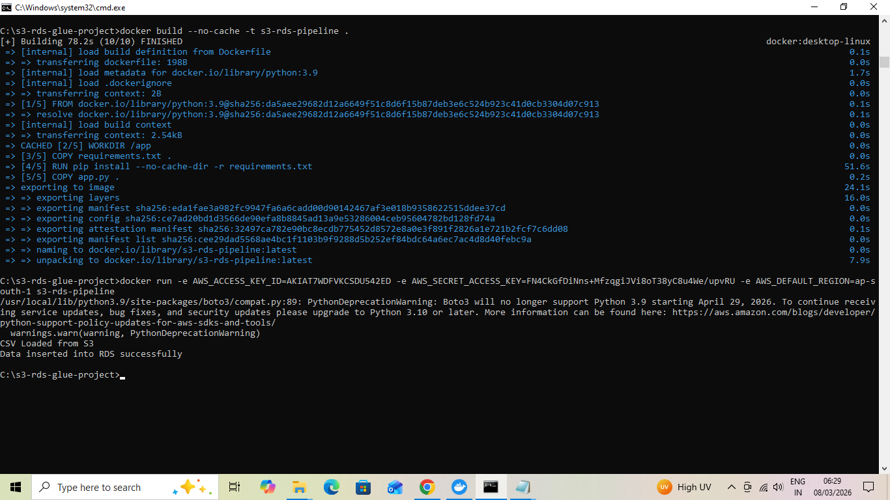
---

#  Verify Data in RDS

Connect to the MySQL database and run:

```sql
SELECT * FROM people;
```

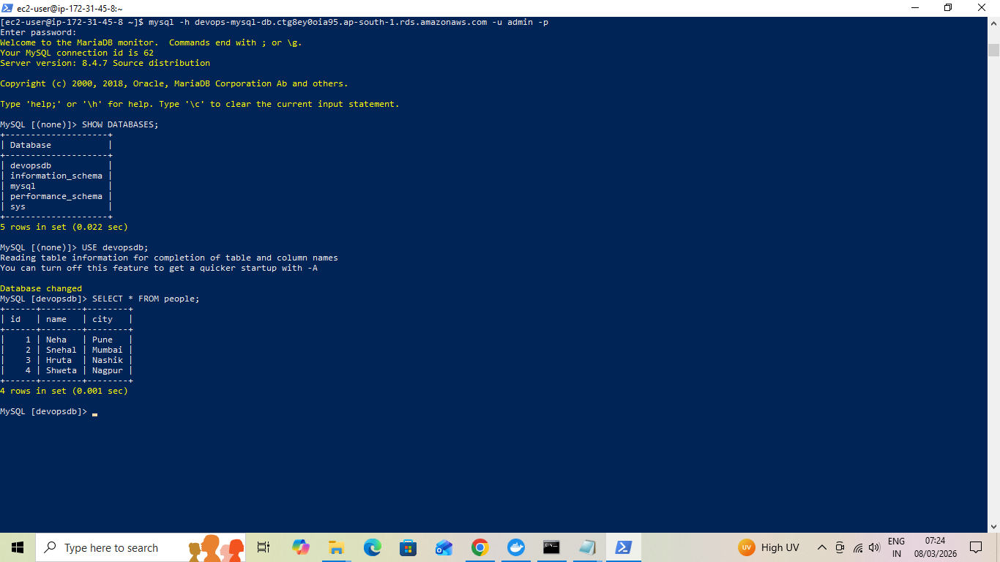

---

#  EC2 Instance for Database Access

An EC2 instance is used to securely connect to the RDS database.

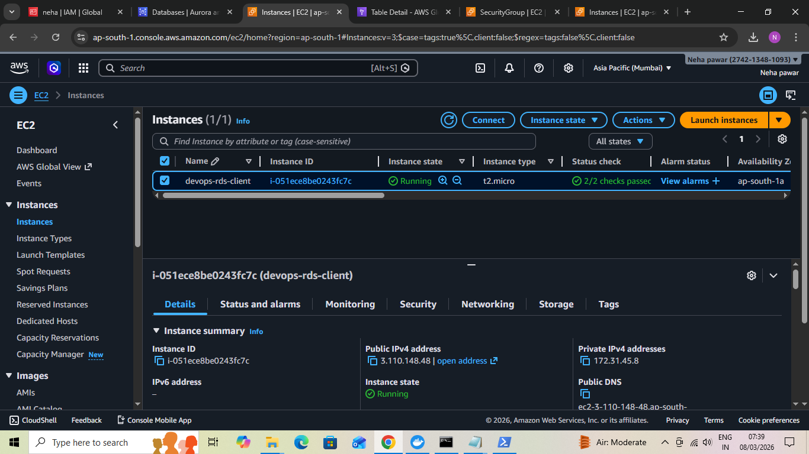
---

#  AWS Glue Fallback

If the RDS insertion fails, the application automatically:

* Creates a table in AWS Glue
* Registers the dataset location from S3
* Stores schema metadata

Screenshots:

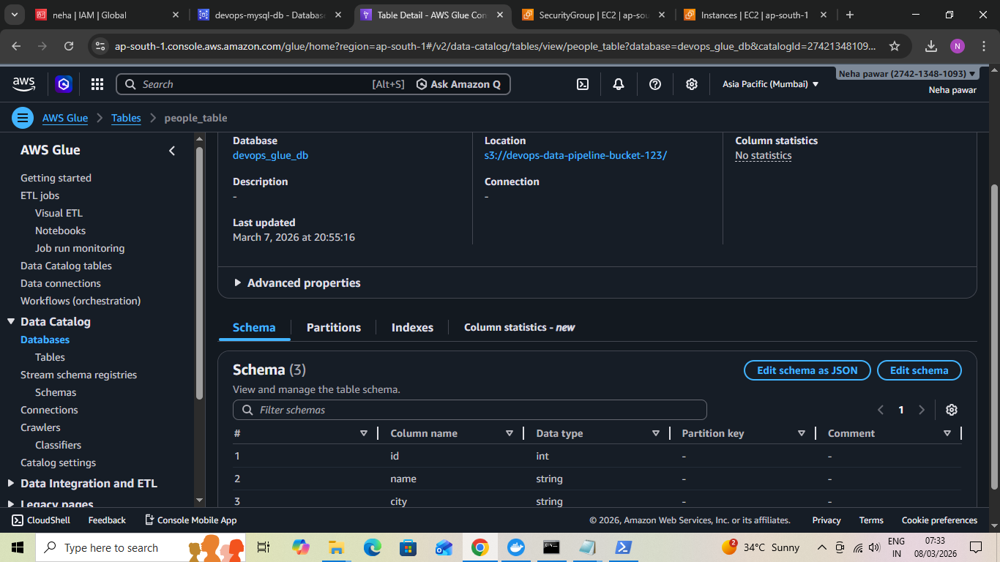

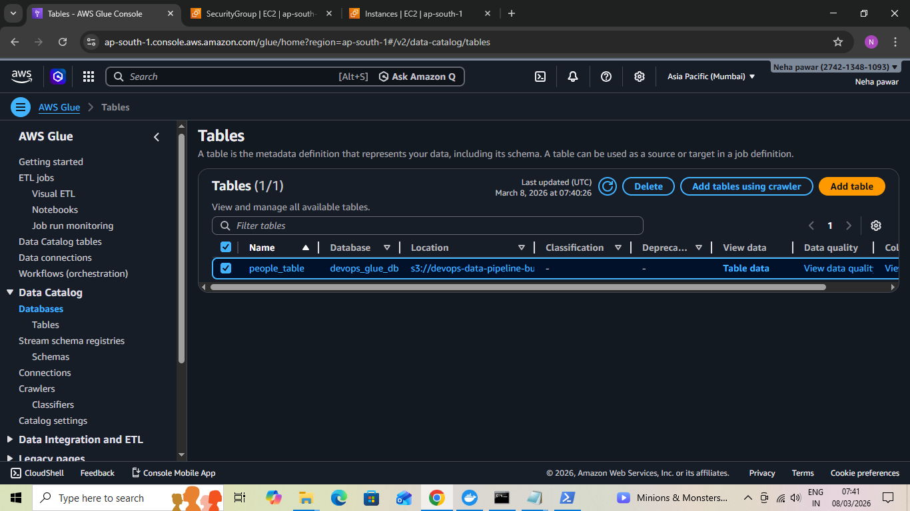

---

#  Project Outcome

 Automated cloud data ingestion pipeline
 Dockerized Python application
 Integration of AWS services
 Fault-tolerant architecture

---

#  Key Learnings

* Designing resilient cloud data pipelines
* Integrating AWS services (S3, RDS, Glue)
* Containerizing applications using Docker
* Implementing fallback mechanisms in cloud workflows

---

---

#  About Me

**Neha Pawar**
DevOps & Cloud Enthusiast 


---

#  Connect with Me

* **GitHub**
  https://github.com/Iamnehapawar

* **LinkedIn**
  https://www.linkedin.com/in/neha-pawar-3ba4a131b

* **Medium**
  https://medium.com/@nehapawar29005

---

